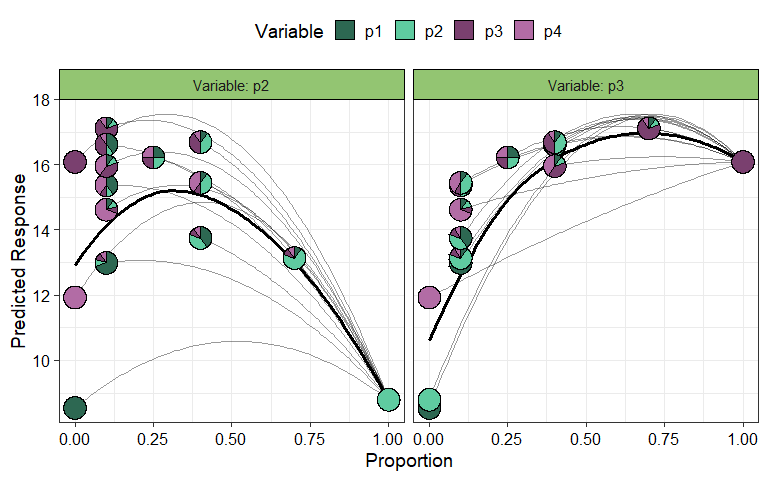

<!-- README.md is generated from README.Rmd. Please edit that file -->

# DImodelsVis

<!-- badges: start -->
<!-- badges: end -->

Statistical models fit to compositional data are often difficult to
interpret due to the sum to 1 constraint on data variables.
`DImodelsVis` provides novel visualisations tools to aid with the
interpretation of models fit to compositional data. All visualisations
in the package are created using the `ggplot2` plotting framework and
can be extended like every other ggplot object.

## Installation

You can install the released version of `DImodelsVis` from
[CRAN](https://cran.r-project.org/) by running:

``` r
install.packages("DImodelsVis")
```

You can install the development version of `DImodelsVis` from
[GitHub](https://github.com/) with:

``` r
# install.packages("devtools")
devtools::install_github("rishvish/DImodelsVis")
```

## Details

### Introduction to Diversity-Interactions (DI) models:

While sometimes it is of interest to model a compositional data
response, there are times when the predictors of a response are
compositional, rather than the response itself. Diversity-Interactions
(DI) models ([Kirwan et al., 2009](https://doi.org/10.1890/08-1684.1),
[Connolly et al., 2013](https://doi.org/10.1111/1365-2745.12052), [Moral
et al., 2023](https://doi.org/10.1111/2041-210X.14158)) are a regression
based modelling technique for analysing and interpreting data from
biodiversity experiments that explore the effects of species diversity
on the different outputs (called ecosystem functions) produced by an
ecosystem. Traditional techniques for analysing diversity experiments
quantify species diversity in terms of species richness (i.e., the
number of species present in a community). The DI method builds on top
of this richness approach by taking the relative abundances of the
species within in the community into account, thus the predictors in the
model are compositional in nature. The DI approach can differentiate
between communities with same set of species but with different relative
proportions, thereby enabling us to better capture the relationship
between diversity and ecosystem functions within an ecosystem. The
[`DImodels`](https://cran.r-project.org/web/packages/DImodels/) and
[`DImodelsMulti`](https://cran.r-project.org/web/packages/DImodelsMulti/)
R packages are available to aid the user in fitting these models. The
`DImodelsVis` (DI models Visualisation) package is a complimentary
package for visualising and interpreting the results from these models.
However, the package is versatile and can be used with any standard
statistical model object in R where the predictor space is compositional
in nature.

### Package Map

<div style="display: block; margin-left: auto; margin-right: auto;  width: 60%; max-width:75;">


</div>

The functions in the package can be categorised as functions for
visualising model selection and validation or functions to aid with
model interpretation. Here is a list of important visualisation
functions present in the package along with a short description.

#### Model selection and validation

- [`model_diagnostics`](): Create diagnostics plots for a statistical
  model with the additional ability to overlay the points with
  [pie-glyphs](https://cran.r-project.org/web/packages/PieGlyph/)
  showing the proportions of the compositional predictor variables.
- [`model_selection`](): Show a visual comparison of selection criteria
  of different models. Can also show the split of an information
  criteria into deviance and penalty components to visualise why a
  parsimonious model would be preferable over a complex one.

#### Model interpretation

- [`prediction_contributions`](): The predicted response for
  observations is visualised as a stacked bar-chart showing the
  contributions of each term in the regression model.
- [`gradient_change`](): The predicted response for specific
  observations are shown using pie-glyphs along with the average change
  in the predicted response over the richness or evenness diversity
  gradients.
- [`conditional_ternary`](): Fix n-3 compositional variables to have
  specific values and visualise the change in the predicted response
  across the remaining three variables as a contour plot in a ternary
  diagram.
- [`visualise_effects`](): Visualise the effect of increasing or
  decreasing a predictor variable (from a set of compositional predictor
  variables) on the predicted response whilst keeping the ratio of the
  other n-1 compositional predictor variables constant.
- [`simplex_path`](): Visualise the change in the predicted response
  along a straight line between two points in the simplex space.

#### Other utility functions

- [`add_prediction`](): A utility function to add prediction and
  associated uncertainty to data using a statistical model object or raw
  model coefficients.
- [`get_equi_comms`](): Utility function to create all possible
  combinations of equi-proportional communities at a given level of
  richness from a set of n compositional variables.
- [`custom_filter`](): A handy wrapper around the dplyr
  [`filter()`](https://dplyr.tidyverse.org/reference/filter.html)
  function enabling the user to filter rows which satisfy specific
  conditions for compositional data like all equi-proportional
  communities, or communities with a given value of richness without
  having to make any changes to the data or adding any additional
  columns.
- [prop_to_tern_proj]() and [tern_to_prop_proj](): Helper functions for
  converting between 3-d compositional data and their 2-d projection.  
- [`ternary_data`]() and [`ternary_plot`](): Visualise the change in the
  predicted response across a set of three compositional predictor
  variables as a contour map within a ternary diagram.

## Examples

### Load libraries

``` r
library(DImodels)
library(DImodelsVis)
```

### Load data

This dataset originates from a grassland biodiversity experiment
conducted in Switzerland as part of the “Agrodiversity Experiment”
[Kirwan et al 2014](https://doi.org/10.6084/m9.figshare.c.3307098.v1).
In this study, 68 grassland plots consisting of 1 to 4 species were
established across a gradient of species diversity. The proportions of
four species were varied across the plots: there were plots with 100% of
a single species (called the mono-culture of a species), and 2- and
4-species mixtures with varying proportions (e.g., (0.5, 0.5, 0, 0) and
(0.7, 0.1, 0.1, 0.1)). Nitrogen fertilizer (at 50 or 150 kg/ha/yr) and
seeding density (low or high) treatments were also manipulated across
the plots. The total annual yield per plot was recorded for the first
year after establishment. An analysis of the this dataset can be found
in [Kirwan et al 2009](https://doi.org/10.1890/08-1684.1). For our
example we only consider the plots that received the 150 kg nitrogen
treatment. The four species proportions form our compositional
predictors while the annual yield is our continuous response.

``` r
data(Switzerland)
my_data <- Switzerland[Switzerland$nitrogen == 150, ]
my_data
#>    plot nitrogen density         p1         p2         p3         p4     yield
#> 1     1      150    high 0.70000000 0.10000000 0.10000000 0.10000000 13.518226
#> 2     2      150    high 0.10000000 0.70000000 0.10000000 0.10000000 13.165491
#> 3     3      150    high 0.10000000 0.10000000 0.70000000 0.10000000 19.956815
#> 4     4      150    high 0.10000000 0.10000000 0.10000000 0.70000000 17.939759
#> 5     5      150    high 0.25000000 0.25000000 0.25000000 0.25000000 13.747188
#> 6     6      150    high 0.40000000 0.40000000 0.10000000 0.10000000 15.118993
#> 7     7      150    high 0.40000000 0.10000000 0.40000000 0.10000000 15.043933
#> 8     8      150    high 0.40000000 0.10000000 0.10000000 0.40000000 13.945801
#> 9     9      150    high 0.10000000 0.40000000 0.40000000 0.10000000 17.106227
#> 10   10      150    high 0.10000000 0.40000000 0.10000000 0.40000000 16.027143
#> 11   11      150    high 0.10000000 0.10000000 0.40000000 0.40000000 16.023593
#> 12   12      150    high 1.00000000 0.00000000 0.00000000 0.00000000  7.557189
#> 13   13      150    high 0.00000000 1.00000000 0.00000000 0.00000000  8.939131
#> 14   14      150    high 0.00000000 0.00000000 1.00000000 0.00000000 14.914930
#> 15   15      150    high 0.00000000 0.00000000 0.00000000 1.00000000 11.656958
#> 16   16      150     low 0.70000000 0.10000000 0.10000000 0.10000000 13.134471
#> 17   17      150     low 0.10000000 0.70000000 0.10000000 0.10000000 14.105120
#> 18   18      150     low 0.10000000 0.10000000 0.70000000 0.10000000 18.765197
#> 19   19      150     low 0.10000000 0.10000000 0.10000000 0.70000000 14.604967
#> 20   20      150     low 0.25000000 0.25000000 0.25000000 0.25000000 15.035616
#> 21   21      150     low 0.40000000 0.40000000 0.10000000 0.10000000 14.964529
#> 22   22      150     low 0.40000000 0.10000000 0.40000000 0.10000000 15.769347
#> 23   23      150     low 0.40000000 0.10000000 0.10000000 0.40000000 14.691042
#> 24   24      150     low 0.10000000 0.40000000 0.40000000 0.10000000 17.248476
#> 25   25      150     low 0.10000000 0.40000000 0.10000000 0.40000000 15.116861
#> 26   26      150     low 0.10000000 0.10000000 0.40000000 0.40000000 15.456562
#> 27   27      150     low 1.00000000 0.00000000 0.00000000 0.00000000  8.165878
#> 28   28      150     low 0.00000000 1.00000000 0.00000000 0.00000000  7.724708
#> 29   29      150     low 0.00000000 0.00000000 1.00000000 0.00000000 13.216234
#> 30   30      150     low 0.00000000 0.00000000 0.00000000 1.00000000 10.945496
#> 31   31      150    high 0.50000000 0.50000000 0.00000000 0.00000000  9.351909
#> 32   32      150    high 0.50000000 0.00000000 0.50000000 0.00000000 18.517219
#> 33   33      150    high 0.50000000 0.00000000 0.00000000 0.50000000 12.604805
#> 34   34      150    high 0.00000000 0.50000000 0.50000000 0.00000000 18.157540
#> 35   35      150    high 0.00000000 0.50000000 0.00000000 0.50000000 11.700099
#> 36   36      150    high 0.00000000 0.00000000 0.50000000 0.50000000 13.004998
#> 37   37      150     low 0.50000000 0.50000000 0.00000000 0.00000000 10.400162
#> 38   38      150     low 0.50000000 0.00000000 0.50000000 0.00000000 17.964517
#> 39   39      150     low 0.50000000 0.00000000 0.00000000 0.50000000 14.863247
#> 40   40      150     low 0.00000000 0.50000000 0.50000000 0.00000000 15.516316
#> 41   41      150     low 0.00000000 0.50000000 0.00000000 0.50000000 13.633705
#> 42   42      150     low 0.00000000 0.00000000 0.50000000 0.50000000 14.313228
#> 43   43      150    high 0.90000000 0.03333333 0.03333333 0.03333333 10.221588
#> 44   44      150    high 0.03333333 0.90000000 0.03333333 0.03333333 11.446586
#> 45   45      150    high 0.03333333 0.03333333 0.90000000 0.03333333 17.963409
#> 46   46      150    high 0.03333333 0.03333333 0.03333333 0.90000000 12.741563
#> 47   47      150     low 0.90000000 0.03333333 0.03333333 0.03333333 11.740538
#> 48   48      150     low 0.03333333 0.90000000 0.03333333 0.03333333 11.383062
#> 49   49      150     low 0.03333333 0.03333333 0.90000000 0.03333333 15.950515
#> 50   50      150     low 0.03333333 0.03333333 0.03333333 0.90000000 16.935109
```

### Fit model with compositional data

We fit different models with different interaction structures as
described in [Moral et al
2023](https://doi.org/10.1111/2041-210X.14158).

``` r
mod_ID <- DI(y = "yield", prop = 4:7, 
             DImodel = "ID", data = my_data)
#> Fitted model: Species identity 'ID' DImodel
mod_AV <- DI(y = "yield", prop = 4:7,
             DImodel = "AV", data = my_data)
#> Fitted model: Average interactions 'AV' DImodel
mod_FG <- DI(y = "yield", prop = 4:7,
             DImodel = "FG", data = my_data,
             FG = c("G", "G", "H", "H"))
#> Fitted model: Functional group effects 'FG' DImodel
mod_ADD <- DI(y = "yield", prop = 4:7,
             DImodel = "ADD", data = my_data)
#> Fitted model: Additive species contributions to interactions 'ADD' DImodel
mod_FULL <- DI(y = "yield", prop = 4:7,
             DImodel = "FULL", data = my_data)
#> Fitted model: Separate pairwise interactions 'FULL' DImodel
```

### Model selection and validation

#### Visualising model selection

We can visualise model selection by passing our models as a list to the
`model_selection` function and visualising the best performing metric
across different information criteria. Run `?model_selection` or see the
associated [vignette]() for more information on customising the plot.

``` r
mods = list("ID" = mod_ID, "AV" = mod_AV, "FG" = mod_FG, 
            "ADD" = mod_ADD, "FULL" = mod_FULL)
model_selection(models = mods, metric = c("AIC", "AICc", "BIC", "BICc"))
```


The model `mod_FG` (labelled as “FG”) is the best model as it has the
lowest value for all the information criteria. We proceed with this
model.

The coefficients are as follows

``` r
summary(mod_FG)
#> 
#> Call:
#> glm(formula = fmla, family = family, data = data)
#> 
#> Coefficients:
#>            Estimate Std. Error t value Pr(>|t|)    
#> p1_ID        8.5406     0.7627  11.198 2.50e-14 ***
#> p2_ID        8.7926     0.7627  11.528 9.70e-15 ***
#> p3_ID       16.0825     0.7627  21.086  < 2e-16 ***
#> p4_ID       11.9263     0.7627  15.637  < 2e-16 ***
#> FG_bfg_G_H  17.3817     2.1713   8.005 4.66e-10 ***
#> FG_wfg_G     7.6604     4.4234   1.732   0.0905 .  
#> FG_wfg_H     1.0119     4.4234   0.229   0.8201    
#> ---
#> Signif. codes:  0 '***' 0.001 '**' 0.01 '*' 0.05 '.' 0.1 ' ' 1
#> 
#> (Dispersion parameter for gaussian family taken to be 2.370592)
#> 
#>     Null deviance: 10290.75  on 50  degrees of freedom
#> Residual deviance:   101.94  on 43  degrees of freedom
#> AIC: 193.51
#> 
#> Number of Fisher Scoring iterations: 2
```

#### Model diagnostics

After choosing a model we can create diagnostics plot where the points
are replaced by pie-glyphs showing the proportions of the compositional
variables. Run `?model_diagnostics` or see the associated [vignette]()
for more information on customising the plot.

``` r
model_diagnostics(model = mod_FG)
#> ✔ Created all plots.
```


Replacing the points with pie-glyphs could help us to quickly identify
any problematic observations in the model. For example, we can see here
that the diagnostics plots look fine and no assumptions seem to be
violated. However, we can quickly spot that the all mono-cultures
(communities with only 1 species) and certain communities with 2 species
have high leverage values compared to all other communities in the data.

### Model interpretation

#### Predictor contributions to predicted response

We visualise the predicted response for specific observations as a
stacked bar-chart showing the contribution (predictor coefficient \*
predictor value) of each term in the model.

``` r
prediction_contributions(model = mod_FG, 
                         data = my_data[c(1:5, 12:15),])
#> ✔ Finished data preparation.
#> ✔ Created plot.
```


The coloured bars show the contributions of the different terms in the
model. The contribution is defined as the product of the coefficient and
value for each predictor variable. Thus, the contribution for a term
would be zero if it’s value in an observation is zero regardless of it’s
coefficient value (e.g. prediction bars for the mono-cultures at the
right of the graph).

This plot would aid in understanding why certain observations have
higher predictions. For e.g., we can see that higher predictions are
primarily driven by the `p3_ID` and `p4_ID` terms and hence the `p1` and
`p2` mono-cultures have low predictions as the all the other terms have
a value of zero here. Similarly, we can also see that mixtures dominated
by `p3` perform the best. Run `?prediction_contributions` or see the
associated [vignette]() for more information on creating and customising
the plot.

#### Average change in respone over diversity gradient

Next we show a scatterplot of the predicted response across all
equi-proportional mixtures at each level of richness (number of species
in a community). The points are replaced with pie-glyphs to show the
proportions of the different species while the dashed black line shows
the average change in response over the richness gradient.

``` r
# Create data including all equi-proportional communities at 
# each level of richness
plot_data <- get_equi_comms(nvars = 4, variables = paste0("p", 1:4))
# Show the average change over richness
gradient_change(mod_FG, data = plot_data)
#> ✔ Finished data preparation
#> ✔ Created plot.
```


This shows that on average the predicted response increases as richness
increases but at a saturating rate. Run `?gradient_change` or see the
associated [vignette]() for more information on creating and customising
the plot.

#### Conditional ternary diagrams

Ternary diagrams are a great tool for visualising the change in a
continuous response, however they can only be created for examples with
three compositional variables. If we have more than three compositional
variables we create conditional ternary diagrams where fix n-3
compositional variables to have specific values and visualise the change
in the predicted response across the remaining three variables as a
contour plot in a ternary diagram.

For this example, since we have four species we can condition one of the
species (say `p2`) to have a specific values 0.2, 0.5, and 0.8 and see
how the response is affected as we change the proportions of the other
three species whilst ensuring that the sum of the four species
proportions is 1.

``` r
conditional_ternary(model = mod_FG, 
                    tern_vars = c("p1", "p3", "p4"),
                    conditional = data.frame("p2" = c(0.2, 0.5, 0.8)))
#> Preparing data ■■■■■■■■■■■■■■■■■■■■■             67% | ETA:  1s                                                                ✔ Finished data preparation.
#> ✔ Created plot.
```


This figure shows that the predicted response decreases as we increase
the proportion of `p2` and is maximised as we increase the proportion of
`p3`. Run `?conditional_ternary` or see the associated [vignette]() for
more information on creating and customising the plot.

#### Effects plots for models with compositional predictors

Effects plots are great for visualising the average effect of a
predictor in a model. However, if the predictors are compositional in
nature, then standard effects plots are not very useful because of the
sum to 1 constraint. The `visualise_effects` function creates effects
plot for the compositional predictors in a model by ensuring that the
sum to one constraint is respected as we increase or decrease the
proportion of a particular variable.

In this example we specify few communities using the `data` argument and
see the change in the predicted response as we increase the proportions
of the species `p2` and `p3`in each community whilst keeping the ratio
of the other species constant.

``` r
visualise_effects(model = mod_FG, data = my_data[1:15, ],
                  var_interest = c("p2", "p3"))
#> ✔ Finished data preparation.
#> ✔ Created plot.
```



The grey lines show the effect (on the predicted response) of increasing
the species of interest within a particular community while the solid
black line shows the average effect of increasing the proportion of a
species on the predicted response. It can be seen that for all
communities increasing `p2` results in a decrease in the predicted
response while increasing `p3` has a positive effect on the predicted
response. Run `?visualise_effects` or see the associated [vignette]()
for more information on creating and customising the plot.

#### Simplex path

The concept used in `visualise_effects` can be extended to look at the
change in the predicted response as we move in a straight line between
any two points within the simplex space. We can even traverse a path
comprising of multiple points within the simplex and see the change in
the predicted response. In this example we show the change in the
response as we move from the centroid mixture to the monoculture of each
of the four species.

``` r
simplex_path(model = mod_FG, 
             starts = my_data[5, ],
             ends = my_data[12:15, ])
#> ✔ Finished data preparation.
#> ✔ Created plot.
```


We can see that moving from the centroid community to `p1`, `p2`, and
`p4` decreases the predicted response, while moving towards a
monoculture of `p3` increases the response. Run `?simplex_path` or see
the associated [vignette]() for more information on creating and
customising the plot.

## See Also

#### Useful links:

- DI models website: <https://dimodels.com>
- Package website}: To be updated
- Github repo: <https://github.com/rishvish/DImodelsVis>
- Report bugs: <https://github.com/rishvish/DImodelsVis/issues>

#### Package family:

- [DImodels](https://cran.r-project.org/web/packages/DImodels/)
- [DImodelsMulti](https://cran.r-project.org/web/packages/DImodelsMulti/)
- [PieGlyph](https://cran.r-project.org/web/packages/PieGlyph/)

## References

- Connolly J, T Bell, T Bolger, C Brophy, T Carnus, JA Finn, L Kirwan, F
  Isbell, J Levine, A Lüscher, V Picasso, C Roscher, MT Sebastia, M
  Suter and A Weigelt (2013) An improved model to predict the effects of
  changing biodiversity levels on ecosystem function. Journal of
  Ecology, 101, 344-355.
- Moral, R.A., Vishwakarma, R., Connolly, J., Byrne, L., Hurley, C.,
  Finn, J.A. and Brophy, C., 2023. Going beyond richness: Modelling the
  BEF relationship using species identity, evenness, richness and
  species interactions via the DImodels R package. Methods in Ecology
  and Evolution, 14(9), pp.2250-2258
- Kirwan L., Connolly J., Finn J.A., Brophy C., Lüscher A., Nyfeler D.
  and Sebastia M.T. 2009. Diversity-interaction modelling - estimating
  contributions of species identities and interactions to ecosystem
  function. Ecology, 90, 2032-2038.
- Kirwan, L., Connolly, J., Brophy, C., Baadshaug, O.H., Belanger, G.,
  Black, A., Carnus, T., Collins, R.P., Čop, J., Delgado, I. and De
  Vliegher, A., 2014. The Agrodiversity Experiment: three years of data
  from a multisite study in intensively managed grasslands.
