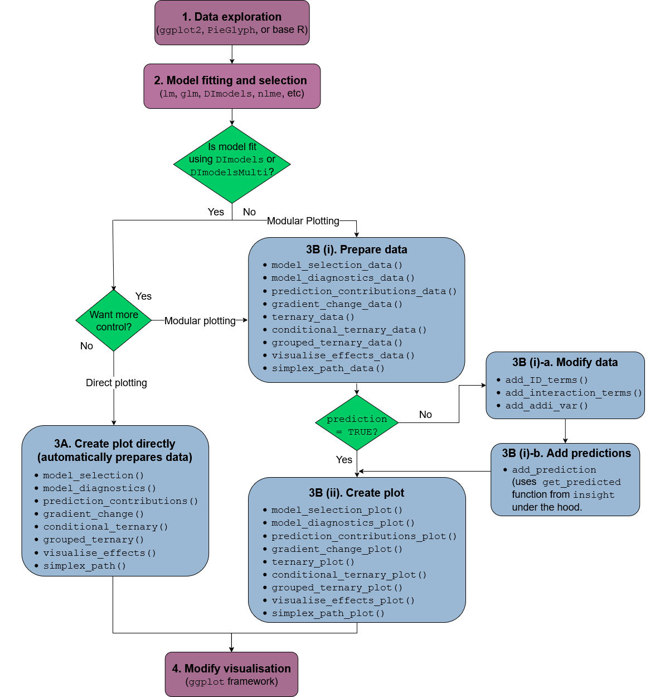

# DImodelsVis: Model interpretation and visualisation for compositional data

Statistical models fit to compositional data are often difficult to
interpret due to the sum to one constraint on data variables.
`DImodelsVis` provides novel visualisations tools to aid with the
interpretation for models where the predictor space is compositional in
nature. All visualisations in the package are created using the
[`ggplot2`](https://ggplot2.tidyverse.org/reference/ggplot2-package.html)
plotting framework and can be extended like every other `ggplot` object.

## Details

### **Introduction to Diversity-Interactions (DI) models:**

While sometimes it is of interest to model a compositional data
response, there are times when the predictors of a response are
compositional, rather than the response itself. Diversity-Interactions
(DI) models (Kirwan et al., 2009; Connolly et al., 2013; Moral et al.,
2023;) are a regression based modelling technique for analysing and
interpreting data from biodiversity experiments that explore the effects
of species diversity on the different outputs (called ecosystem
functions) produced by an ecosystem. Traditional techniques for
analysing diversity experiments quantify species diversity in terms of
species richness (i.e., the number of species present in a community).
The DI method builds on top of this `richness` approach by taking the
relative abundances of the species within in the community into account,
thus the predictors in the model are `compositional` in nature. The `DI`
approach can differentiate among different species identities as well as
between communities with same set of species but with different relative
proportions, thereby enabling us to better capture the relationship
between diversity and ecosystem functions within an ecosystem. The
[`DImodels`](https://rdrr.io/pkg/DImodels/man/DImodels-package.html) and
[`DImodelsMulti`](https://di-laurabyrne.github.io/DImodelsMulti/reference/DImodelsMulti.html)
R packages are available to aid the user in fitting these models. The
`DImodelsVis` (DI models Visualisation) package is a complimentary
package for visualising and interpreting the results from these models.
However, the package is versatile and can be used with any standard
statistical model object in R where the predictor space is compositional
in nature.

### **Package Map:**



The functions in the package can be categorised as functions for
visualising model selection and validation or functions to aid with
model interpretation. Here is a list of important visualisation
functions present in the package along with a short description.

**Model selection and validation**  

- **[`model_diagnostics`](https://rishvish.github.io/DImodelsVis/reference/model_diagnostics.md)**:
  Create diagnostics plots for a statistical model with the additional
  ability to overlay the points with
  [`pie-glyphs`](https://rishvish.github.io/PieGlyph/reference/PieGlyph-package.html)
  showing the proportions of the compositional predictor variables.

- **[`model_selection`](https://rishvish.github.io/DImodelsVis/reference/model_selection.md)**:
  Show a visual comparison of selection criteria for different models.
  Can also show the split of an information criteria into deviance and
  penalty components to visualise why a parsimonious model would be
  preferable over a complex one.

**Model interpretation**  

- **[`prediction_contributions`](https://rishvish.github.io/DImodelsVis/reference/prediction_contributions.md)**:
  The predicted response for observations is visualised as a stacked
  bar-chart showing the contributions of each term in the regression
  model.

- **[`gradient_change`](https://rishvish.github.io/DImodelsVis/reference/gradient_change.md)**:
  The predicted response for specific observations are shown using
  [`pie-glyphs`](https://rishvish.github.io/PieGlyph/reference/PieGlyph-package.html)
  along with the average change in the predicted response over the
  richness or evenness diversity gradients.

- **[`conditional_ternary`](https://rishvish.github.io/DImodelsVis/reference/conditional_ternary.md)**:
  Assuming we have `n` compositional variables, fix `n-3` compositional
  variables to have specific values and visualise the change in the
  predicted response across the remaining three variables as a contour
  plot in a ternary diagram.

- **[`visualise_effects`](https://rishvish.github.io/DImodelsVis/reference/visualise_effects.md)**:
  Visualise the effect of increasing or decreasing a predictor variable
  (from a set of compositional predictor variables) on the predicted
  response whilst keeping the ratio of the other `n-1` compositional
  predictor variables constant.

- **[`simplex_path`](https://rishvish.github.io/DImodelsVis/reference/simplex_path.md)**:
  Visualise the change in the predicted response along a straight line
  between two points in the simplex space.

All functions aiding with model interpretation have a corresponding
`*_data` function to prepare the underlying data and a `*_plot` function
which accepts this data and creates the plot. Such a split between the
data-preparation and plotting functions results in a lot of flexibility
for the user. This also enables the users to create these visualisations
with any statistical model object in R.

**Other utility functions**  

- **[`add_prediction`](https://rishvish.github.io/DImodelsVis/reference/add_prediction.md)**:
  A utility function to add prediction and associated uncertainty to
  data using a statistical model object or raw model coefficients.

- **[`get_equi_comms`](https://rishvish.github.io/DImodelsVis/reference/get_equi_comms.md)**:
  Utility function to create all possible combinations of
  equi-proportional communities at a given level of richness from a set
  of `n` compositional variables.

- **[`custom_filter`](https://rishvish.github.io/DImodelsVis/reference/custom_filter.md)**:
  A handy wrapper around the dplyr
  [`filter()`](https://dplyr.tidyverse.org/reference/filter.html)
  function enabling the user to filter rows which satisfy specific
  conditions for compositional data like all equi-proportional
  communities, or communities with a given value of richness without
  having to make any changes to the data or adding any additional
  columns.

- **[`prop_to_tern_proj`](https://rishvish.github.io/DImodelsVis/reference/Simplex_projection.md)**
  and
  **[`tern_to_prop_proj`](https://rishvish.github.io/DImodelsVis/reference/Simplex_projection.md)**:
  Helper functions for converting between 3-d compositional data and
  their 2-d projection.

- **[`ternary_data`](https://rishvish.github.io/DImodelsVis/reference/ternary_data.md)**
  and
  **[`ternary_plot`](https://rishvish.github.io/DImodelsVis/reference/ternary_plot.md)**:
  Visualise the change in the predicted response across a set of three
  compositional predictor variables as a contour map within a ternary
  diagram.

## References

- Connolly J, T Bell, T Bolger, C Brophy, T Carnus, JA Finn, L Kirwan, F
  Isbell, J Levine, A Lüscher, V Picasso, C Roscher, MT Sebastia, M
  Suter and A Weigelt (2013) An improved model to predict the effects of
  changing biodiversity levels on ecosystem function. Journal of
  Ecology, 101, 344-355.

- Moral, R.A., Vishwakarma, R., Connolly, J., Byrne, L., Hurley, C.,
  Finn, J.A. and Brophy, C., 2023. Going beyond richness: Modelling the
  BEF relationship using species identity, evenness, richness and
  species interactions via the DImodels R package. Methods in Ecology
  and Evolution, 14(9), pp.2250-2258.

- Kirwan L, J Connolly, JA Finn, C Brophy, A Lüscher, D Nyfeler and MT
  Sebastia (2009) Diversity-interaction modelling - estimating
  contributions of species identities and interactions to ecosystem
  function. Ecology, 90, 2032-2038.

## See also

Useful links:

- **DI models website**: <https://dimodels.com>

- **Package website**: <https://rishvish.github.io/DImodelsVis/>

- **Github repo**: <https://github.com/rishvish/DImodelsVis>

- **Report bugs**: <https://github.com/rishvish/DImodelsVis/issues>

Package family:

- [`DImodels`](https://rdrr.io/pkg/DImodels/man/DImodels-package.html)

- [`DImodelsMulti`](https://di-laurabyrne.github.io/DImodelsMulti/reference/DImodelsMulti.html)

- [`PieGlyph`](https://rishvish.github.io/PieGlyph/reference/PieGlyph-package.html)

## Author

**Maintainter:** Rishabh Vishwakarma <vishwakr@tcd.ie>
([ORCID](https://orcid.org/0000-0002-4847-3494))

**Authors:**  

- Caroline Brophy

- Laura Byrne

- Catherine Hurley

## Examples

``` r
## Load libraries
library(DImodels)
library(DImodelsVis)

## Load data
data(sim2)
sim2 <- sim2[sim2$block == 1, ]

## Fit model with compositional data
mod <- DI(y = "response", prop = 3:6,
          DImodel = "AV", data = sim2)
#> Fitted model: Average interactions 'AV' DImodel

## Model diagnostics plots but points are replaced by
## pie-glyphs showing the proportions of the compositional variables
## See `?model_diagnostics` for more information
# \donttest{
model_diagnostics(model = mod, which = c(1, 2))
#> ✔ Created all plots.

# }

## Visualise the predicted response variable as contributions
## (predictor coefficient * predictor value) from the individual
## terms in the model
## See `?prediction_contributions` for more information
prediction_contributions(model = mod)
#> ✔ Finished data preparation.
#> ✔ Created plot.


## Visualise the change in average response over a diversity gradient
## This plot shows the change in the response over a diversity gradient
## We use richness (number of non-zero variables in a given observation)
## as our gradient in this example. The black line shows the average response
## at each level of richness while the position of the pie-glyphs show variations
## about this average whilst also showing the relative abundances of each
## variable in the composition.
## See `?gradient_change` for more information
plot_data <- get_equi_comms(nvars = 4, variables = c("p1", "p2", "p3", "p4"))
gradient_change(model = mod, data = plot_data)
#> ✔ Finished data preparation
#> ✔ Created plot.


## Visualise effects of increasing or decreasing a variable
## within a set of compositional variables
## This plot shows the effect of increasing the proportion of p1
## in several different initial compositions of the variables
## p1, p2, p3, and p4. Each curve shows the effect of increasing
## the proportion of p1 whilst keeping the relative proportions of
## the other three variables unchanged
## See `?visualise_effects` for more information
visualise_effects(model = mod,
                  data = sim2[1:11, ],
                  var_interest = "p1")
#> ✔ Finished data preparation.
#> ✔ Created plot.


## Visualise the change in the predicted response along a straight line
## between two points in the simplex space.
## We visualise the change in the response as we from the centroid mixture to
## each of the monocultures
## See `?simplex_path` for more information
simplex_path(model = mod,
             starts = sim2[5,],
             ends = sim2[12:15,])
#> ✔ Finished data preparation.
#> ✔ Created plot.


## Visualise slices of the n-dimensional simplex as ternary diagrams.
## 2-d slices of the n-dimensional simplex are created by conditioning
## certain compositional variables at a specific values `p` while the
## remaining variables are allowed to vary within the range `0` to `1-p`.
## In this example variable p1 is conditioned to have values `0`, `0.2`, and `0.5`
## One ternary diagram is created for each case where p2, p3, and p4 are
## allowed to vary from `0` upto `1`, `0.8`, and `0.5`, respectively.
## This is equivalent to taking multiple slices of the n-dimensional simplex
## and viewing multiple slices would enable us to get a picture the change
## in the response across the n-dimensional simplex.
## For example the response is maximised where p1 is 0.2
## See `?conditional_ternary` for more information
# \donttest{
conditional_ternary(model = mod, tern_vars = c("p2", "p3", "p4"),
                    conditional = data.frame("p1" = c(0, 0.2, 0.5)),
                    contour_text = FALSE,
                    resolution = 1)
#> ✔ Finished data preparation.
#> ✔ Created plot.

# }
```
